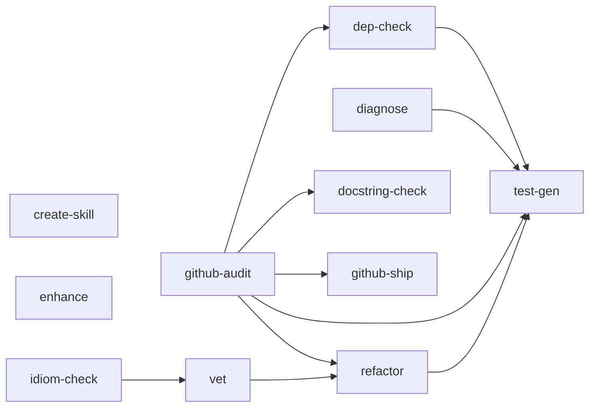

# Claude Code Custom Skills

[](LICENSE)
[](https://github.com/thijsvos/Claude_Skills/actions/workflows/lint.yml)

A curated collection of custom skills for [Claude Code](https://docs.anthropic.com/en/docs/claude-code) that extend its capabilities with specialized, reusable workflows.

[Claude Code skills](https://docs.anthropic.com/en/docs/claude-code) are prompt-based extensions that add new slash commands to your Claude Code CLI. Install a skill, then invoke it with `/<skill-name>` — no plugins or config needed.

## Available Skills

| Skill | Description | Model | Effort | Example |
|-------|-------------|-------|--------|---------|
| [enhance](skills/enhance/) | Performs deep multi-phase project analysis to identify and recommend the single most impactful addition to implement. | Opus | xhigh | [view](skills/enhance/README.md#example) |
| [github-audit](skills/github-audit/) | Audits a GitHub repository against best practices and provides prioritized recommendations for README, license, community health, CI/CD, and repository settings. | Opus | xhigh | [view](skills/github-audit/README.md#example) |
| [vet](skills/vet/) | Structured code review across correctness, security, performance, and conventions with prioritized findings and fix offers. | Opus | xhigh | [view](skills/vet/README.md#example) |
| [test-gen](skills/test-gen/) | Analyzes code to generate comprehensive tests covering happy paths, edge cases, error handling, and integration points, matching the project's existing test conventions. | Opus | xhigh | [view](skills/test-gen/README.md#example) |
| [dep-check](skills/dep-check/) | Scans all dependency declarations across ecosystems, checks for updates and vulnerabilities, and produces a prioritized update plan with testing recommendations. | Opus | xhigh | [view](skills/dep-check/README.md#example) |
| [diagnose](skills/diagnose/) | Multi-agent root cause analysis that traces errors, correlates with recent changes, and identifies fixes with ranked hypotheses. | Opus | xhigh | [view](skills/diagnose/README.md#example) |
| [refactor](skills/refactor/) | Comprehensive code refactoring across correctness, security, performance, and maintainability with behavior-preserving, incremental changes. | Opus | xhigh | [view](skills/refactor/README.md#example) |
| [create-skill](skills/create-skill/) | Interactive skill generator that scaffolds new skills following all project conventions, serving as the definitive reference for skill creation. | Opus | xhigh | [view](skills/create-skill/README.md#example) |
| [docstring-check](skills/docstring-check/) | Scans a codebase for missing, outdated, drifted, or inconsistent docstrings and applies behavior-preserving fixes matching the project's detected convention. | Opus | xhigh | [view](skills/docstring-check/README.md#example) |
| [github-ship](skills/github-ship/) | Turns local changes into a GitHub issue and linked PR, or cleans up the branch if the PR was already merged. Auto-detects which. | Opus | xhigh | [view](skills/github-ship/README.md#example) |
| [idiom-check](skills/idiom-check/) | Audits a codebase through a programming-language-specific idiom lens, produces a prioritized report, and offers remediation in PR-sized bundles. | Opus | xhigh | [view](skills/idiom-check/README.md#example) |

<!-- handoff-graph:start -->
<details>
<summary><strong>Cross-skill handoff graph</strong> — how skills chain into one another</summary>

Several skills can hand off to another skill after their primary action (e.g. `/vet` → `/refactor`). Auto-generated from [`skills.json`](skills.json) by [`tools/generate-handoff-graph.sh`](tools/generate-handoff-graph.sh); full version in [docs/handoff-graph.md](docs/handoff-graph.md).



</details>
<!-- handoff-graph:end -->

## Quick Start

### Install All Skills

```bash
git clone https://github.com/thijsvos/Claude_Skills.git
cd Claude_Skills
./install.sh
```

### Install a Single Skill

```bash
./install.sh enhance
```

### Install as a Plugin (no `install.sh`)

The repo ships a plugin manifest (`.claude-plugin/plugin.json`), so a clone placed directly under your skills directory loads as a plugin on the next session — no symlinks, no install step:

```bash
git clone https://github.com/thijsvos/Claude_Skills.git ~/.claude/skills/claude-skills
```

Skills are then namespaced as `/claude-skills:vet`, `/claude-skills:refactor`, and so on; `git pull` in that directory updates them. Use one method or the other — installing both ways gives you every skill twice (`/vet` and `/claude-skills:vet`).

### Use a Skill

Once installed, invoke any skill inside Claude Code:

```
> /enhance
> /github-audit
> /vet src/auth/
> /test-gen src/utils.ts
> /dep-check
> /diagnose TypeError: Cannot read properties of undefined
> /refactor src/auth/handler.ts
> /create-skill "API documentation generator"
> /docstring-check src/
> /github-ship
> /idiom-check
```

## How It Works

Skills are installed as **symlinks** from `~/.claude/skills/<name>` to this repository. The repo is the source of truth — pull to update, and your skills update automatically.

```
~/.claude/skills/enhance  ->  /path/to/Claude_Skills/skills/enhance
```

### Updating Skills

```bash
cd /path/to/Claude_Skills
git pull
```

That's it. Since skills are symlinked, pulling updates the actual skill files.

### Managing Context Cost

Every installed skill's `description` + `when_to_use` is rendered into the skill listing at the start of each session. That listing is budgeted at 1% of the context window by default (`skillListingBudgetFraction`) and each entry is capped at 1,536 characters (`skillListingMaxDescChars`) — `lint.sh` warns if a skill here exceeds that. If you only use a few of these skills:

- Run `/skill-doctor` (Claude Code 2.1.261+) to see what each skill costs and how often it gets used.
- Collapse or hide the ones you don't need without editing files, via `skillOverrides` (the `/skills` menu writes this for you into `.claude/settings.local.json`):

  ```json
  { "skillOverrides": { "enhance": "name-only", "idiom-check": "off" } }
  ```

  Values: `on` (default), `name-only`, `user-invocable-only` (hidden from Claude, still in the `/` menu), `off`.
- Or simply install only what you use: `./install.sh vet refactor`.

## Adding a New Skill

Each skill lives in its own directory under `skills/` with at minimum a `SKILL.md` file:

```
skills/
└── my-skill/
    ├── SKILL.md      # Skill definition (consumed by Claude Code)
    └── README.md     # Human-readable documentation
```

The `SKILL.md` file uses frontmatter to configure the skill:

```yaml
---
name: my-skill
description: What the skill does
allowed-tools: Read, Grep, Glob
model: opus          # optional: opus, sonnet, haiku, fable, inherit (aliases only)
effort: xhigh        # optional: low, medium, high, xhigh, max
---

Skill prompt content here...
```

After adding a skill, update the table in this README and run `./install.sh my-skill`.

Starter templates are available in the `templates/` directory. See [CLAUDE.md](CLAUDE.md) for the full skill format specification and conventions.

## Development

### Validating Skills

Run the linter to check all skills follow the project conventions:

```bash
./lint.sh            # Check all skills
./lint.sh enhance    # Check a specific skill
```

The linter validates:
- Required frontmatter fields (`name`, `description`, `allowed-tools`)
- Skill name matches directory name
- README.md exists with required sections (What It Does, Requirements, Usage, Configuration)
- Frontmatter against `schemas/skill-frontmatter.schema.json`, the Workflow/Agent fan-out conventions, cross-skill handoffs, `skills.json` freshness, and the plugin manifest version — see [CLAUDE.md](CLAUDE.md#validation) for the full list

CI additionally runs Claude Code's own validator (`claude plugin validate ./skills --strict`), which parses every `SKILL.md` with the real frontmatter parser:

```bash
claude plugin validate ./skills --strict   # skills, strict
claude plugin validate .                   # plugin manifest
```

### Templates

The `templates/` directory contains starter files for new skills:
- `templates/SKILL.md` — Skill definition with all frontmatter fields documented
- `templates/README.md` — Documentation template with all required sections

## Contributing

Contributions are welcome! See [CONTRIBUTING.md](CONTRIBUTING.md) for guidelines on creating and submitting skills.

- **Propose a skill**: [open a Skill Request](https://github.com/thijsvos/Claude_Skills/issues/new?template=skill_request.yml)
- **Report a bug**: [open a Bug Report](https://github.com/thijsvos/Claude_Skills/issues/new?template=bug_report.yml)
- **Security issues**: see [SECURITY.md](SECURITY.md)
- **Community standards**: see [CODE_OF_CONDUCT.md](CODE_OF_CONDUCT.md)

## License

[MIT](LICENSE)
