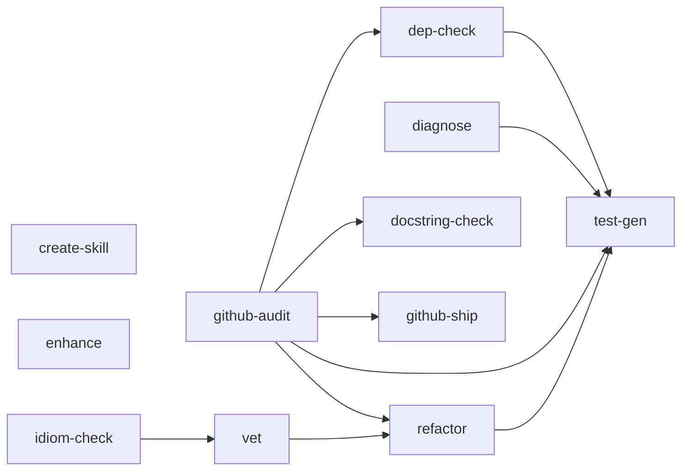

```mermaid
flowchart LR
    create_skill["create-skill"]
    dep_check["dep-check"]
    diagnose["diagnose"]
    docstring_check["docstring-check"]
    enhance["enhance"]
    github_audit["github-audit"]
    github_ship["github-ship"]
    idiom_check["idiom-check"]
    refactor["refactor"]
    test_gen["test-gen"]
    vet["vet"]
    dep_check --> test_gen
    diagnose --> test_gen
    github_audit --> dep_check
    github_audit --> docstring_check
    github_audit --> github_ship
    github_audit --> refactor
    github_audit --> test_gen
    idiom_check --> vet
    refactor --> test_gen
    vet --> refactor
```
